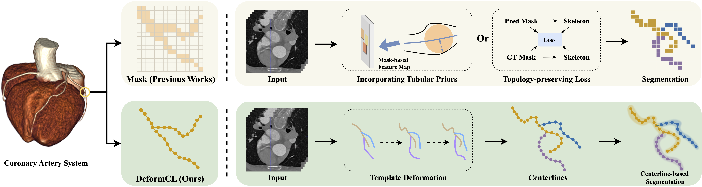
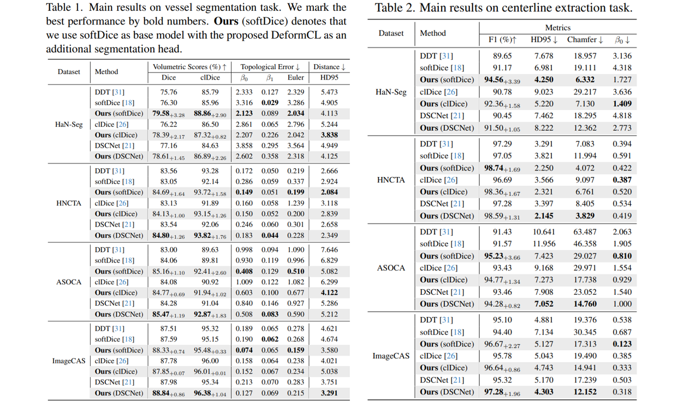
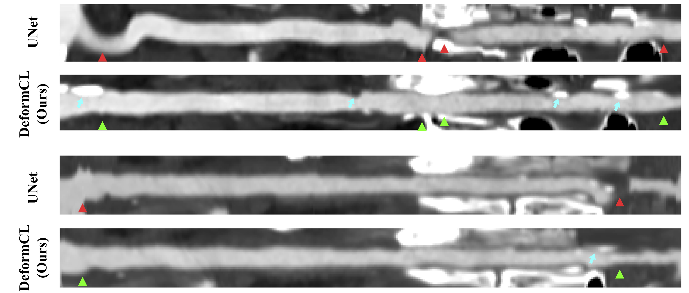
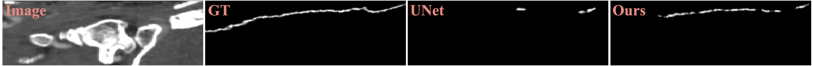

# DeformCL: Learning Deformable Centerline Representation for Vessel Extraction in 3D Medical Image

This repo is the official implementation of our CVPR 2025 paper: **DeformCL: Learning Deformable Centerline Representation for Vessel Extraction in 3D Medical Image** [link] as well as the follow-ups. We have made every effort to ensure that the codebase is clean, concise, easily readable, and relies only on minimal dependencies.

## Table of Contents
- [Introduction](#introduction)
- [Main Results](#main-results)
- [Usage](#usage)
- [Possible Issues](#possible-issues)
- [Citation](#citation)
- [Potential Research](#potential-research)
- [Acknowledgments](#acknowledgments)

## Introduction


In the field of 3D medical imaging, accurately extracting and representing the blood vessels with curvilinear structures holds paramount importance for clinical diagnosis. Previous methods have commonly relied on discrete representation like mask, often resulting in local fractures or scattered fragments due to the inherent limitations of the per-pixel classification paradigm. In this work, we introduce DeformCL, a new continuous representation based on Deformable Centerlines, where centerline points act as nodes connected by edges that capture spatial relationships. Compared with previous representations, DeformCL offers three key advantages: natural connectivity, noise robustness, and interaction facility. We present a comprehensive training pipeline structured in a cascaded manner to fully exploit these favorable properties of DeformCL. Extensive experiments on four 3D vessel segmentation datasets demonstrate the effectiveness and superiority of our method. Furthermore, the visualization of curved planar reformation images validates the clinical significance of the proposed framework.

## Main Results

We benchmark DeformCL on four 3D medical datasets, and the extensive experiments validate the effectiveness of our proposed method. Additionally, due to its continuous nature, DeformCL’s centerline predictions can be directly used as a structural representation of vessels, commonly as directional centerlines. This structural representation is crucial in clinical practice, serving as an indispensable component in various subsequent diagnostic tasks, such as curved planar reformation and computational hemodynamics. We qualitatively demonstrate the clinical relevance of DeformCL, highlighting its potential applicability for diagnostic purposes.

<div style="display: flex; justify-content: space-around; width: 100%;">
    
</div>

### SCPR images

<div style="display: flex; justify-content: space-around; width: 100%;">
    
</div>

### Occluded Vessels

We present a challenging case involving almost completely occluded vessels, which are highly difficult for deep learning models due to their near invisibility. As in the figure, our method produces fragmented predictions. However, it significantly outperforms the previous mask-based representation, thanks to its continuous property.

<div style="display: flex; justify-content: space-around; width: 100%;">
    
</div>

## Usage

### Codebase Overview

This codebase provides the official PyTorch implementation of the DeformCL model, including detailed implementations of data processing, model architecture, training, evaluation, and other components. Users can quickly reproduce the DeformCL model based on this codebase. The structure of the code repository is as follows:

```python
DeformCL
	|-configs
		|-....yaml
	|-vesselseg
		|-data
		|-evaluation
		|-modeling
		|-__init__.py
		|-config.py
	|-images
	|-process_dataset.py
	|-run_bboxdt_L.sh
	|-run_bboxdt_R.sh
	|-run_hanseg_L_deformcl.sh
	|-run_hanseg_L_unet.sh
	|-run_hanseg_R_deformcl.sh
	|-run_hanseg_R_unet.sh
	|-train_net.py
	|-train_utils.py
```

Although the code repository meticulously implements every detail of the DeformCL model, it's important to emphasize that these specific configurations are not necessarily the only correct choices. In fact, for different datasets, there may be multiple viable architectural designs. However, the underlying modeling philosophy of "template generation - personalized fitting" remains consistent across all these implementations.

### Environmant Preparation

This codebase can only run on linux system. You may need to prepare a conda environmant before running the codes.

Run the following bash commands to prepare the environment:

```bash
conda create -n deformcl python=3.9
conda activate deformcl
conda install numpy==1.23.5
conda install -c pytorch pytorch==1.10.1 torchvision==0.11.2 cudatoolkit=11.3
conda install -c simpleitk simpleitk
conda install matplotlib scikit-image=0.19.3
conda install -c fvcore -c iopath -c conda-forge fvcore iopath
python -m pip install detectron2==0.6 -f \
  https://dl.fbaipublicfiles.com/detectron2/wheels/cu113/torch1.10/index.html
pip install pillow==9.5.0 
conda install https://mirrors.tuna.tsinghua.edu.cn/anaconda/cloud/pytorch3d/linux-64/pytorch3d-0.7.3-py39_cu113_pyt1101.tar.bz2
pip install pandas
pip install opencv-python
pip install nvidia_ml_py3==7.352.0
pip install setuptools==59.5.0
```

### Dataset Preparation
Run the following bash command to prepare the dataset HaN-Seg:

```bash
python process_dataset.py
```

### Training & Evaluation

Since the images in HaN-Seg dataset are too large, we adopt a two-stage segmentation pipeline. First, we use a small UNet to predict the bounding box of the down-sampled CT image, and crop the ROI region out. Next, we make final segmentations using some models on the cropped ROI regions.

All the models are trained on 4 GPUs. You can modify the configuration according to your own situation. Due to limitations in dataset size and bounding box (bbox) prediction accuracy, the vessel segmentation results exhibit some fluctuations.

**It is worth noting that this two-stage processing approach is proposed specifically for the HaN-Seg dataset. For other datasets, whether to adopt this processing pipeline needs to be determined according to the characteristics of the data.**

##### Step 1: Bounding box prediction

For clarity in both training and inference, we employ separate models for each vessel type: Carotid_L and Carotid_R.

Run the following command to train the bbox prediction model:

```bash
sh run_bboxdt_L.sh
sh run_bboxdt_R.sh
```
##### Step 2: Vessel Segmentation

Run the following command to train the DeformCL model:

```bash 
sh run_hanseg_L_deformcl.sh
sh run_hanseg_R_deformcl.sh
```

Run the following command to train the UNet baseline model:

```bash
sh run_hanseg_L_unet.sh
sh run_hanseg_R_unet.sh
```

##### Inference

Example 

```bash 
python train_net.py --num-gpus 4 --dist-url auto --eval-only \
--config-file configs/bbox.yaml \
MODEL.PRED_CLASS 1 \
MODEL.WEIGHTS "outputs/BBOXDT_L/model_final.pth" \
OUTPUT_DIR "outputs/infer_BBOXDT_L" \
```

##### Evaluation

The metric will be automatically recorded in the training log.

## Possible Issues

To make the code concise, understandable, and less dependent on external libraries, we modified and refactored the experimental code before its release. Despite thorough checks prior to publication, this process may still introduce certain issues (including compatibility issues with the user's machine and potential bugs). We have compiled a list of potential problems you may encounter when using this code repository.

1. GPU OOM Error: Try fp-16 training by adding the line in the bash files:

   ```bash
   SOLVER.AMP.ENABLED True
   ```


## Citation
Please consider citing our work as follows if it is helpful.
```
TBD
```

## Potential Research 
* Application of DeformCL in other tubular structure segmantation problems.
* Make DeformCL better adapt complexed networks.

## Acknowledgments
DeformCL uses codes from a few open source repositories. Without the efforts of these folks (and their willingness to release their implementations), DeformCL would not be possible. We thanks these authors for their efforts!